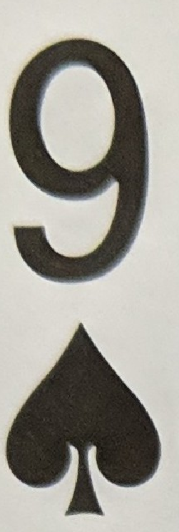

                                            Playing Cards Detecting Project   

                                          İbrahim Anıl Yurtsever, Sırrı Bakırtan
                         Department of Computer Engineering, Eskişehir Technical University, Eskişehir
                                  anil131@eskisehir.edu.tr, sirribakirtan@eskisehir.edu.tr

Abstract   
  This project aims to create a card recognition system using image recognition techniques with Matlab.
                Keywords-component; image recognition; matlab;
  

I.Introduction
   
  With this project, we created a card recognition system that takes rotated, angled, with differerent backgrounds, non overlapping    card images and defined the cards in the image. We defined an algorithm to process the image, define the card areas, and        recognize them individually.

II.Algorithm

<ol>
<li> Create an array for segmented images, define each card in the image, segment the card and add it to the array.</li>
<li> Apply quadrilateral transformation the segmented image to convert the card image to a vertical format.</li>
<li> Crop the top left part, segment number and type, subtract type from each defined type template, return the one with least value, apply the same technique to number segment.</li>
</ol>

  II.a Algorithm Flow Chart

   

III.	Example
   

1.	Segmenting the cards
  
  

2.	Quadrilateral transformation
 
  

3.	Crop number and type
 
  

4.	Calculate the differences by subtraction
 
  

 
 

5.	Select the least calculated difference value

  

IV.Conclusion
  
Accuracy = 83.018

Results
  
  

 

(Acquired Confusion Matrix Chart)
  
  

 
 

             
V. Future Work
   
  Some improvements can be made in this project such as classifying using color red and black.Thanks to color,we can improve 
   
  our f1 score.On the other hand,this project can also be done using  neural networks.For example,Darknet - Yolo,using opencv.

                                                                                  

   
  Thanks to 
  <a href="https://github.com/AnilYurtsever">İbrahim Anil Yurtsever</a>
  

